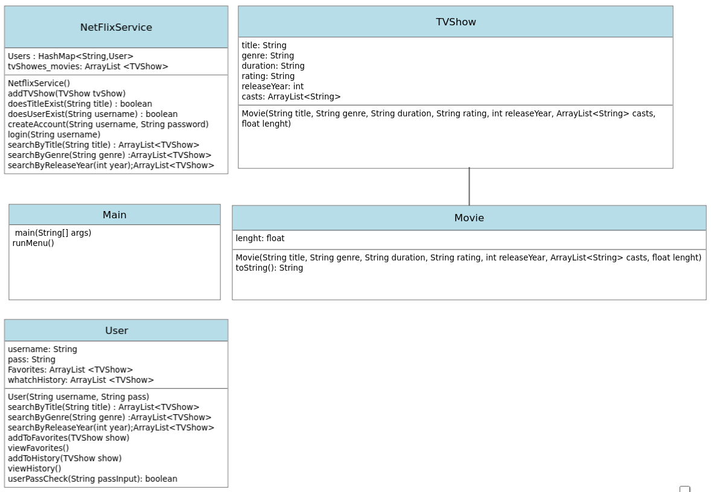

# **In the name of god**
# *abolfazl keypour*
# Fourth-Assignment-Netflix

## Introduction
This program is a simulation of Netflix. The program allow users to create and manage their accounts and profiles, browse movies, and manage their movies. The program designed using OOP principles.
## Design and Implementation

### Functions that need explanation
- In Main class, runmenu has `sign in`, `sign up`, `admin` and `exit`. sign in gets username and password and send it to login at NetFlixServices. Sign up creates account and add it on users hashmap at NetFlixServices. admin gets username and password(only code has one admin). Admin has been added for adding movie or TVShow.
- Login function, run menu of user(`Search on all`, `Search on favorite`, `add favorite`, `watching`, `view History`, `logout`).
- Searching function gets input, and compares it with all of arraylist elements. If it was equals, add it to output arraylist.
- `Search on all` has `Search by title`, `Search by genre`, `Search by Release Year` and `Back`.
- `Search on favorite` has `View Favorites`, `Search favorites by title`, `Search favorites by genre`, `Search favorites by Release Year` and `Back`.
- In `watching` enter title of movie or TVShow that you want to watch. Then it add to history.
## Testing and Evaluation
- Sometimes I copied function and pasted, then changed several parts of it. Sometimes I didn't pay attention and I didn't change parts that needed correction and it made some mistakes.
- Menus at first debuging had a lot of problems, like it could not exit, it printed repetitious sentences and etc.
- Java scanner has a problem. When I get int(nextInt) and then want to get string(nextLine), sometimes it can't get string, it needs "in.nextline".
- I was confused at first because code had very function. Then I made UML. It was very useful for understaning code.
## Conclusion
- We can develop code with swing or javaFX for geraphical program.
- We can add another property for librarian and users.
- We can use database for saving data and keep them when program is closed.